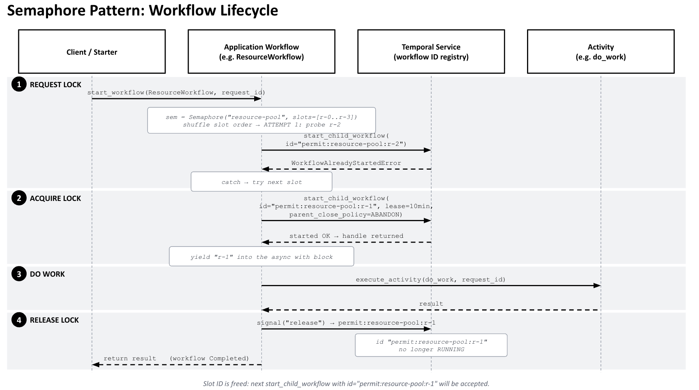

# Temporal Workflow Throttler

A reusable, durable, scalable throttler for [Temporal](https://temporal.io) workflows. Cap how many workflows can run a critical section concurrently, hold a fixed pool of named resources (GPUs, DB connections, vendor API quotas), or gate any other "at most N at a time" workload.

The trick: each held permit is **its own child workflow**, and its workflow id (e.g. `permit:gpu-pool:gpu-2`) is the lock. Temporal does not allow two running workflows with the same id, so an attempt to start a second child for an already held slot fails atomically with `WorkflowAlreadyStartedError`. The library has zero activities, no central limiter, no Redis, and no shared state outside Temporal itself.

## You will need

| Tool | Purpose |
|------|---------|
| [`uv`](https://docs.astral.sh/uv/) | Python package + venv management |
| `node` and `npm` | The web UI (Vite + React + TypeScript) |
| [Temporal CLI](https://docs.temporal.io/cli) | Local dev server: `temporal server start-dev` |

## Setup

```bash
uv sync
cd web && npm install && cd ..
cp .env.example .env   # tweak only if you're not using the local dev defaults
```

### Pointing at Temporal Cloud (optional)

Edit `.env` to use a Cloud namespace + API key. The worker, API, and CLI starter all pick these up automatically and connect with TLS.

```bash
TEMPORAL_ADDRESS=us-east-1.aws.api.temporal.io:7233   # your regional gRPC host
TEMPORAL_NAMESPACE=my-namespace.my-account            # full namespace.account-id
TEMPORAL_API_KEY=...                                  # UI -> API Keys -> Create
```

For self-hosted Temporal fronted by TLS but without API-key auth, set `TEMPORAL_TLS=true` instead of an API key.

## Run it

Open four terminals.

```bash
# 1. local Temporal dev server (UI: http://localhost:8233)
temporal server start-dev

# 2. throttler worker (registers PermitSlotWorkflow + 3 demo workflows)
uv run python -m worker.main

# 3. demo HTTP API (FastAPI on http://localhost:8000)
uv run python -m api.main

# 4. demo UI (Vite on http://localhost:5173)
cd web && npm run dev
```

Open **http://localhost:5173**. Three scenario cards. Each card has:

- A **slots** slider (1 to 16) per resource, controlling how many slots that pool has for the next burst.
- A **burst** slider (1 to 50), controlling how many workflows to launch on click.
- A **Run** button.
- A live slot grid that fills as permits are taken and empties as they are released, plus a recent runs list.

Each demo workflow holds its slot for about ten seconds so the throttling effect is clearly visible in the grid.

## Try the scenarios

| Card | What it shows |
|------|---------------|
| **GPU Pool** | Resource lock with named slots (`gpu-0`, `gpu-1`, ...). Each workflow is handed a specific GPU id to use. Default 4 slots. Set burst to 10, click Run, watch the grid fill to 4 of 4 while six more workflows queue up in their backoff loops. |
| **Ingest Pipeline** | Three nested semaphores (OCR / Embed / Store) protecting downstream services. Each workflow takes a slot in each pool sequentially, so all three grids fill independently as documents flow through. Per-pool capacity sliders let you find the bottleneck. |
| **Workflow Gate** | Generic concurrency gate around any workflow. Default 4 slots. Drop a burst of 20 and watch the gate cap concurrency at exactly 4 while the others wait their turn. |

You can also launch from the command line:

```bash
uv run python starter.py gpu --count 10
uv run python starter.py ingest --count 12
uv run python starter.py gate --count 20
```

## Run tests

```bash
uv run pytest
```

8 tests, ~2 seconds, **no external dependencies** (no `temporal server` required, no worker or API running). Each test spins up an in-process Temporal time-skipping environment with mocked activities, so the suite is CI/CD-friendly out of the box.

What's covered:

| Test file | What it verifies |
|---|---|
| `tests/test_permit_slot.py` | A `PermitSlotWorkflow` completes on `release` signal and auto-completes when its lease expires. |
| `tests/test_semaphore.py` | Cap-1 mutex serializes two callers; cap-3 caps concurrent holders to exactly 3 of 6 callers. |
| `tests/test_gpu_scenario.py` | `GpuTrainingWorkflow` acquires a slot from `gpu-pool` and calls `run_training` with the model id and assigned slot name. |
| `tests/test_ingest_scenario.py` | `IngestDocumentWorkflow` calls OCR, Embed, Store activities in order and returns the chained result. |
| `tests/test_gate_scenario.py` | `ThrottledGateWorkflow` acquires the `app-gate` slot and calls `simulate_work` with the configured args. |

## Repository layout

```
throttler/                  reusable library (zero activities)
  workflow.py               PermitSlotWorkflow + Semaphore helper class
  config.py                 connection helper + task queue + defaults
examples/                   three demo workflows + simulated activities
  gpu_workflow.py           resource-lock scenario
  ingest_workflow.py        pipeline scenario (3 nested semaphores)
  gate_workflow.py          generic throttle scenario
  activities.py             sleep-style stubs (~10s) so throttling is visible
worker/main.py              registers everything on the throttler-tq queue
api/main.py                 FastAPI: scenarios, run, status, config, recent
web/                        Vite + React + TypeScript dashboard
  public/                   Temporal logo (light + dark for favicon)
tests/                      pytest suite (time-skipping, mocked, ~2s)
starter.py                  CLI alternative to the UI
```

## Sequence Diagram


## How the lock works

When a workflow calls `Semaphore.acquire(...)`:

1. It shuffles the slot list deterministically (via `workflow.random()`).
2. For each slot in turn it calls `workflow.start_child_workflow(id="permit:{resource}:{slot}", parent_close_policy=ABANDON)`.
3. Temporal guarantees only one running workflow can have that id. If the slot is held, the SDK raises `WorkflowAlreadyStartedError` and the caller skips to the next slot.
4. If every slot is currently held, the workflow sleeps for the backoff window (default 5 seconds) and tries again.

To release, the holder signals the slot workflow with `release`. The slot workflow's `wait_condition` returns, the workflow completes, and its id becomes reusable for the next caller. If the holder dies without releasing, the slot workflow's lease timer (default 10 minutes) fires and the workflow auto-completes, freeing the slot. No external state, no manual cleanup, no orphans.

A few semantic details worth knowing:

- **Acquire is non-FIFO.** When a slot frees up, whichever waiter probes it first wins it. There is no central queue. Use cases that need strict ordering should layer their own ordering on top.
- **Each slot scales independently.** Signal load distributes across N short-lived slot workflows rather than concentrating on one limiter, so the design scales linearly with pool size.
- **Capacity changes apply to new bursts.** Adjusting the slots slider in the UI only affects workflows started afterward. Already-running workflows continue with whatever capacity they were started with. Reducing capacity while permits above the new ceiling are still held is safe (they finish or lease-expire on their own) but the UI will not show those slots until they free up.
